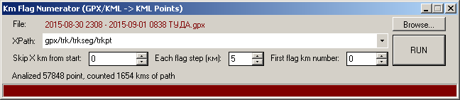

# KMNumerator

Create marker/point for each X kilometer(s) of gpx/kml track/route/polyline

Нумерация маркерами каждого X километра(ов) трека/маршрута/полилинии.

More Utilites for KMZ/KML/GPX files:    
[KMZRebuilder](https://github.com/dkxce/KMZRebuilder)     
[KMZViewer](https://github.com/dkxce/KMZViewer)     
[KMZPOIfromOSM](https://github.com/dkxce/KMZPOIfromOSM)     

